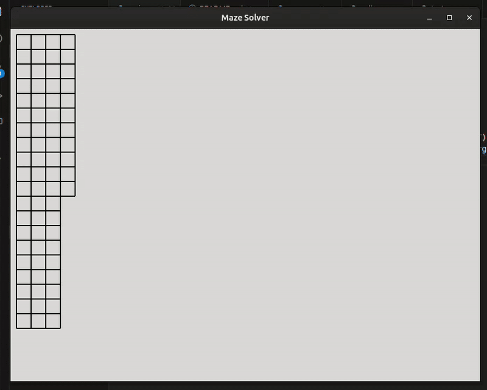

# maze-solver
The 4th mini-project following the boot.dev courses.

This was an interesting project, though I doubt I'll revisit to make any adjustments. In general, I was happy with the code that I wrote for this, but there were definitely areas for improvement. I felt like my maze and cell classes kinda battled each other in terms of functionality and they act more like one class split across two. Furthermore, some of the data structures that I utilized are probably a bit complicated in terms of readability and my code could be improved by writing helper methods that replace the sometimes crazy indexing.

For example:
``` python
self.cells[i][j]["cell"].walls["bottom"]
```

If I were clean up this project, I'd definitely want to make lines like this a bit easier to read. A two-dimensional array that holds dictionaries where the first object in the dictionary is itself a class with methods is a bit over the top to read.

I'd rather it look like this:
```python
# define enum with BOTTOM, TOP, etc.

self.get_cell(i, j).has_wall(BOTTOM)
```

## How to Run
```python
python3 main.py [number of rows] [number of colums]
```

## Code in Action
Input:
```python
python3 main.py 20 30
```

Output:


